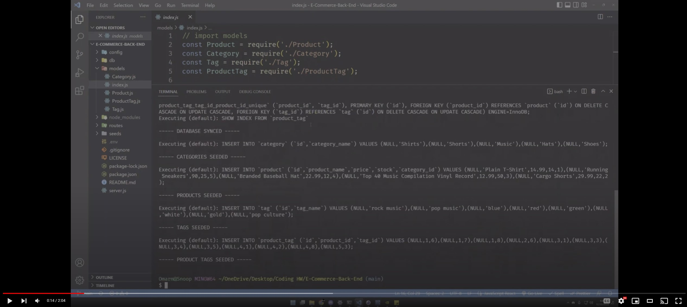

# E-Commerce-Back-End

## Description
- The motivation was to have better understanding of the MVC Paradigm.
- In order to understand how to send data based on specific routes back to the database. 
- It solves the problem in understanding how to structure your backend database to take in information based on user input. 
- Learned how to utilize sequelize to get, post, put, and delete routes based on the user input. 

## Usage


## Youtube (Click on Image to be directed to youtube)

[](https://www.youtube.com/watch?v=xT9JzuOCQjQ)

## Installation

1. ``` npm run seed ```
2. ``` node server.js ```
3. Install a gui application
4. Hit all the routes within the api directory.

## License
[](https://opensource.org/licenses/MIT)

## Features
- Allows user to put, post, get, and delete specific data within the database.